# Hướng Dẫn Huấn Luyện VSLR Trên Cloud GPU (Google Colab & Kaggle)

Tài liệu này hướng dẫn quy trình chuyển giao bước **huấn luyện mô hình (Training)** và **đánh giá độc lập (Evaluation)** sang GPU Cloud miễn phí (NVIDIA Tesla T4 / P100 trên Google Colab hoặc Kaggle), đồng thời giữ các tác vụ nhẹ và phụ thuộc phần cứng (trích xuất MediaPipe đa luồng, webcam demo, fullstack app) tại máy cá nhân.

---

## 1. Phân Chia Vai Trò Hệ Thống (Workflow Separation)

| Nhiệm vụ | Môi trường | Lý do kỹ thuật |
| :--- | :--- | :--- |
| **Trích xuất Landmark MediaPipe** | **Máy cá nhân** (giữ nguyên) | Tác vụ CPU đa luồng (12 workers). CPU free-tier của Colab/Kaggle (2-4 core ảo) không nhanh hơn máy local. |
| **Huấn luyện Model (ST-GCN / Transformer / BiGRU)** | **Kaggle / Colab GPU** | T4/P100 (16GB VRAM) mạnh hơn RTX 3050 Laptop (4GB), tránh nóng máy và chai pin laptop, cho phép train nhiều epoch/k-fold thoải mái. |
| **Đánh giá trên Test Set (`evaluate_test.py`)** | **Kaggle / Colab** | Chạy ngay sau khi train để có số liệu, biểu đồ training curves và ma trận nhầm lẫn tức thì mà không cần tải model về trước. |
| **Webcam Realtime Demo & Giao diện Fullstack** | **Máy cá nhân** | Đòi hỏi truy cập webcam vật lý nội bộ, kết nối WebSocket độ trễ thấp (<30ms). |

---

## 2. Quy Trình 3 Bước Thực Hiện

```mermaid
flowchart LR
    subgraph Local_PC["1. Máy cá nhân (Local)"]
        A["Trích xuất Landmark (.npz)"] --> B["Chạy package_cloud_data.py"]
        B --> C["data/vsl_training_data.zip (~187MB)"]
    end

    subgraph Cloud_GPU["2. Cloud GPU (Colab / Kaggle)"]
        D["Mở vsl_cloud_training.ipynb"] --> E["Nạp vsl_training_data.zip"]
        E --> F["train.py (GPU T4/P100)"]
        F --> G["evaluate_test.py + export_onnx"]
        G --> H["Gom vsl_cloud_results.zip"]
    end

    subgraph Local_Deploy["3. Tải về & Khai thác (Local)"]
        I["Giải nén đè vào repo local"] --> J["realtime_demo.py / fullstack"]
    end

    C -->|Upload| D
    H -->|Download| I
```



---

## Bước 1: Đóng Gói Dữ Liệu Tại Máy Cá Nhân

Chỉ cần nén các tensor tọa độ đã trích xuất (`.npz`), các file chia tập (`data/splits/`), và file danh mục nhãn (`configs/tier*.txt`). **Không upload video thô** để giữ dung lượng siêu gọn (~187 MB).

Tại terminal PowerShell trên máy cá nhân, chạy lệnh:
```powershell
.\.venv\Scripts\python.exe scripts\package_cloud_data.py
```

Kết quả sẽ tạo ra file lưu tại:
`data/vsl_training_data.zip` (chứa 3.039 file `.npz` và toàn bộ split CSV).

---

## Bước 2A: Chạy Trên Google Colab

1. **Mở Notebook:**
   - Truy cập [Google Colab](https://colab.research.google.com/).
   - Chọn tab **Upload** → Tải lên file [`vsl_cloud_training.ipynb`](file:///C:/Users/Admin/Python%20Advanced/Deep%20Learning%20-%20CV/Project/vsl_cloud_training.ipynb).
2. **Kích hoạt GPU:**
   - Vào menu **Runtime** → **Change runtime type** → Hardware accelerator: chọn **T4 GPU** → Bấm **Save**.
3. **Nạp dữ liệu:**
   - Khi chạy đến **Bước 2** trong notebook:
     - **Cách 1 (Khuyên dùng):** Dùng widget upload trực tiếp file `data/vsl_training_data.zip` từ máy tính.
     - **Cách 2:** Tải `vsl_training_data.zip` lên Google Drive cá nhân của bạn, sau đó mount Drive:
       ```python
       from google.colab import drive
       drive.mount('/content/drive')
       ```
4. **Chạy tuần tự:**
   - **Bước 1:** Clone repository và cài thư viện `requirements.txt`.
   - **Bước 2 & 3:** Giải nén và kiểm toán dữ liệu (Data Integrity Check).
   - **Bước 4:** Huấn luyện model (`python train.py --config configs/experiments/stgcn.yaml`).
   - **Bước 5:** Đánh giá độc lập trên Test Set (`python evaluate_test.py`). Notebook sẽ tự động hiển thị bảng điểm, đường cong học và ma trận nhầm lẫn.
   - **Bước 6:** Xuất mô hình sang định dạng ONNX.
   - **Bước 7:** Notebook tự động nén `checkpoints/` và `experiments/` thành `vsl_cloud_results_<timestamp>.zip` và kích hoạt trình duyệt tải về máy cá nhân.

---

## Bước 2B: Chạy Trên Kaggle

1. **Tạo Dataset trên Kaggle:**
   - Vào [Kaggle Datasets](https://www.kaggle.com/datasets) → Bấm **New Dataset**.
   - Đặt tên dataset: `vsl-training-data`.
   - Upload file `vsl_training_data.zip` lên và bấm **Create**.
2. **Tạo Kaggle Notebook:**
   - Bấm **New Notebook** (hoặc Import file [`vsl_cloud_training.ipynb`](file:///C:/Users/Admin/Python%20Advanced/Deep%20Learning%20-%20CV/Project/vsl_cloud_training.ipynb)).
   - Bảng bên phải (**Notebook Settings**):
     - **Accelerator:** Chọn **GPU T4 x2** hoặc **GPU P100**.
     - **Internet:** Bật **Internet on**.
   - Bấm **Add Input** (hoặc dấu `+` ở mục Input) → Chọn dataset `vsl-training-data` vừa tạo.
3. **Chạy Notebook:**
   - Notebook sẽ tự động phát hiện `/kaggle/input/` và giải nén dữ liệu vào `./data/`.
   - Chạy tuần tự các cells từ trên xuống dưới.
   - Sau khi cell cuối cùng chạy xong, file `vsl_cloud_results_<timestamp>.zip` sẽ xuất hiện ở mục **Output** (cột bên phải) → Bấm vào dấu 3 chấm cạnh file và chọn **Download**.

---

## 3. Ma Trận Đối Chiếu Đường Dẫn (Path Mapping Matrix)

Do notebook tự động clone repo và giải nén dữ liệu vào đúng cấu trúc thư mục `./data/`, **toàn bộ đường dẫn tương đối trong các file YAML (`configs/experiments/*.yaml`) được giữ nguyên 100%**:

| Mục | Máy cá nhân (Local) | Google Colab | Kaggle | Cần sửa config không? |
| :--- | :--- | :--- | :--- | :--- |
| **Thư mục làm việc** | `Project/` | `/content/Vietnamese-Sign-Language-Translator/` | `/kaggle/working/Vietnamese-Sign-Language-Translator/` | **Không** |
| **Keypoints dir** | `data/extracted_keypoints` | `data/extracted_keypoints` | `data/extracted_keypoints` | **Không** |
| **Splits dir** | `data/splits` | `data/splits` | `data/splits` | **Không** |
| **Checkpoints dir**| `checkpoints/` | `checkpoints/` | `checkpoints/` | **Không** |
| **Experiments dir**| `experiments/` | `experiments/` | `experiments/` | **Không** |

> **Cam kết không đổi Hyperparameter:**
> Toàn bộ tham số như `batch_size: 16`, `lr: 0.001`, `epochs: 100`, `sequence_length: 60`, `patience: 10`, `graph_strategy: spatial` được giữ nguyên vẹn từ file YAML gốc, đảm bảo tính nhất quán tuyệt đối trong benchmark khoa học.

---

## 4. Bước 3: Đưa Kết Quả Về Lại Máy Cá Nhân & Kiểm Thử

1. Sau khi tải file `vsl_cloud_results_<timestamp>.zip` về máy tính, giải nén đè trực tiếp vào thư mục gốc của project:
   - Các file checkpoint (`stgcn_best.pt`, `stgcn_best.onnx`, v.v.) sẽ nằm trong [`checkpoints/`](file:///C:/Users/Admin/Python%20Advanced/Deep%20Learning%20-%20CV/Project/checkpoints/).
   - Các file báo cáo, đồ thị học tập, ma trận nhầm lẫn sẽ nằm trong [`experiments/`](file:///C:/Users/Admin/Python%20Advanced/Deep%20Learning%20-%20CV/Project/experiments/).
2. Kiểm thử mô hình mới ngay trên máy cá nhân:
   ```powershell
   # 1. Chạy webcam demo trực tiếp bằng checkpoint vừa train:
   .\.venv\Scripts\python.exe realtime_demo.py --model stgcn

   # 2. Hoặc khởi động toàn bộ hệ thống fullstack (FastAPI backend + React frontend):
   .\start_fullstack.ps1
   ```

---

---

## 5. Nguyên Tắc Kiểm Định (VSL Data Integrity & Evaluation Rigor)

Trước và sau khi huấn luyện trên Cloud, hệ thống tuân thủ nghiêm ngặt 2 kỹ năng:
1. **`vsl-data-integrity`**:
   - Đã kiểm tra nguồn gốc dữ liệu: Dữ liệu sử dụng là bộ từ điển video VSL chuẩn (Tier 1: 50 lớp, 3 miền Bắc - Trung - Nam), không sử dụng nhầm dữ liệu ASL.
   - Dữ liệu trước khi đưa lên cloud đã được kiểm toán đếm đủ $N = 3.039$ file keypoints chuẩn xác.
2. **`vsl-evaluation-rigor`**:
   - Quá trình chia split tuân thủ **100% video-disjoint** (tập Test hoàn toàn không chứa video của tập Train).
   - Kiểm định ngay trên Cloud bằng `evaluate_test.py` với ma trận nhầm lẫn đầy đủ trước khi kết luận số liệu vào [`EVALUATION.md`](file:///C:/Users/Admin/Python%20Advanced/Deep%20Learning%20-%20CV/Project/EVALUATION.md).

---

## 6. Huấn Luyện Cấp 1: Bảng Chữ Cái Ký Hiệu VSL (Level 1 - Fingerspelling)

### 📌 Quy cách dữ liệu & thiết kế thử nghiệm:
- **Dữ liệu**: Bộ dữ liệu VSL Alphabet Pilot gồm 1.875 clip (.npz), 15 người ra ký hiệu (`S01`..`S15`), 25 lớp ký hiệu chuẩn tiếng Việt (23 chữ cái tĩnh + `Dau_moc`, `Dau_mu`).
- **Phân chia Signer-Disjoint (10 / 2 / 3)**:
  - **Train** (10 signers): `S01, S04, S05, S06, S07, S08, S09, S10, S11, S13` (1.250 mẫu, 50 mẫu/lớp).
  - **Val** (2 signers): `S02, S12` (250 mẫu, 10 mẫu/lớp).
  - **Test** (3 signers): `S03, S14, S15` (375 mẫu, 15 mẫu/lớp - hoàn toàn độc lập với Train/Val).

### 🚀 Quy trình thực hiện:
1. **Đóng gói dữ liệu tại local** (đã hoàn thành):
   ```powershell
   .\.venv\Scripts\python.exe scripts\package_alphabet_cloud_data.py
   ```
   Tạo file: `data/vsl_alphabet_cloud_data.zip` (~98 MB).

2. **Chạy trên Google Colab / Kaggle**:
   - Mở file [`vsl_alphabet_cloud_training.ipynb`](file:///C:/Users/Admin/Python%20Advanced/Deep%20Learning%20-%20CV/Project/vsl_alphabet_cloud_training.ipynb).
   - Tải file `data/vsl_alphabet_cloud_data.zip` lên môi trường cloud.
   - Chạy tuần tự các cell:
     - Cell 1-2: Kiểm tra GPU và giải nén dữ liệu.
     - Cell 3: Huấn luyện **Static MLP** (21 landmarks palm-scale normalized, 63 chiều).
     - Cell 4: Huấn luyện **Temporal BiGRU** (chuỗi 30 frames).
     - Cell 5: Đánh giá so sánh trên tập Test và tự động lưu mô hình có Test Accuracy cao nhất vào `checkpoints/alphabet_best.pt`.
     - Tải file `alphabet_best.pt` về máy cá nhân.

3. **Kích hoạt tại local**:
   - Đặt file đã tải về vào thư mục [`checkpoints/alphabet_best.pt`](file:///C:/Users/Admin/Python%20Advanced/Deep%20Learning%20-%20CV/Project/checkpoints/alphabet_best.pt).
   - Hệ thống backend sẽ tự động nhận diện checkpoint và kích hoạt giao diện Cấp 1 trên web.

