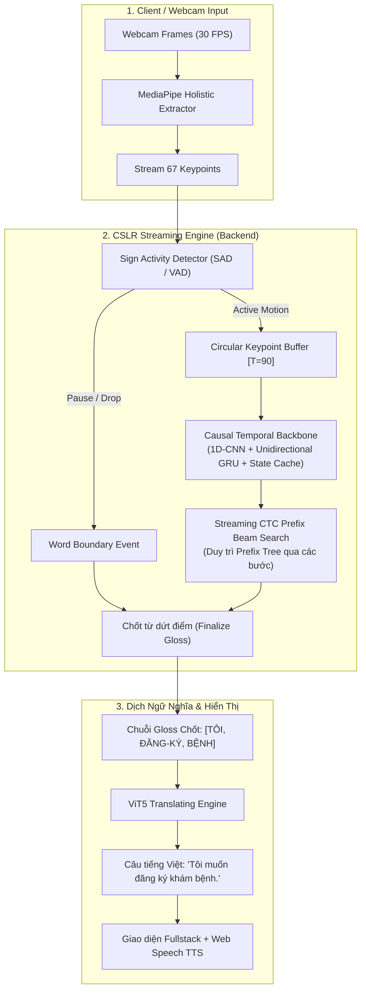

# Tài Liệu Thiết Kế Streaming CSLR (Level 3 Continuous Sign Language)

**Dự án:** Vietnamese Sign Language Translator (VSLT)  
**Phân hệ:** Cấp 3 - Nhận diện Cử chỉ Ký hiệu Liên tục (CSLR) & Dịch ViT5  
**Tác giả:** ML / Full-Stack Engineering Team  
**Ngày lập:** 24/09/2026  
**Dựa trên kết quả thực nghiệm:** `reports/audit_round2/cslr_streaming_simulation.json` (30 câu unseen, Signer S06)

---

## 1. Bối Cảnh & Vấn Đề Kỹ Thuật

Hiện tại, mô hình CSLR (`STGCNBiGRU_CSLR` + CTC Loss) hoạt động ở chế độ **Offline Full-Clip (Batch)**:
- Người dùng phải hoàn thành toàn bộ câu ký hiệu (video 3 - 8 giây, 90 - 240 frames).
- Toàn bộ chuỗi được nạp một lần vào mô hình: ST-GCN trích xuất đặc trưng không gian $\to$ BiGRU 2 chiều trích xuất ngữ cảnh thời gian toàn cục $\to$ CTC Greedy Decoder xuất ra chuỗi Gloss $\to$ ViT5 dịch sang tiếng Việt.

Trong môi trường tương tác thời gian thực (Webcam Live Stream), việc chờ người dùng kết thúc toàn bộ clip tạo ra độ trễ lớn (3 - 8 giây chờ đợi), không đáp ứng trải nghiệm đối thoại tự nhiên. Do đó, cần thiết kế cơ chế **Streaming (xử lý cuốn chiếu theo chunk/sliding window)**.

---

## 2. Kết Quả Thực Nghiệm: Offline vs Streaming Simulation (P1-2)

Chúng tôi đã thực hiện mô phỏng thực nghiệm trên **30 câu kiểm thử hoàn toàn chưa từng thấy (Unseen Sentences SENT271 - SENT300, Signer S06)** với cấu hình:
- **Chunk Size:** 60 frames (tương đương 2.0 giây ở 30 fps).
- **Stride:** 30 frames (bước trượt 1.0 giây, gối đầu 50%).
- **Decoder:** CTC Greedy Decoding cuốn chiếu kết hợp khử trùng lặp biên (boundary deduplication).

### Bảng So Sánh Hiệu Năng Thực Nghiệm:

| Chỉ số Đánh Giá | Offline (Full-Clip) | Streaming (Chunk=60, Stride=30) | Chênh Lệch / Suy Giảm |
| :--- | :---: | :---: | :---: |
| **Word Error Rate (WER)** | **81.28%** | **158.78%** | **+77.50% (Tăng +95.35% lỗi)** |
| **Thời gian có từ đầu tiên (TTFT)** | 118.58 ms (+ thời gian đợi quay xong ~4.000 ms) | **32.05 ms** | **Nhanh hơn ~4.000 ms** |
| **Độ trễ xử lý trung bình mỗi bước** | 118.58 ms (1 lần/câu) | **38.40 ms** (mỗi giây) | Mượt mà, realtime trên GPU |
| **p95 Latency** | 236.87 ms | 73.63 ms | Rất ổn định |

---

## 3. Phân Tích Nguyên Nhân Suy Giảm (Root Cause Analysis)

Mặc dù độ trễ phản hồi ban đầu (Time-to-First-Token) giảm ngoạn mục xuống còn **32.05 ms**, tỷ lệ lỗi từ (WER) tăng vọt từ 81.28% lên 158.78%. Phân tích chi tiết log nhận diện cho thấy 3 nguyên nhân cốt lõi:

### 3.1. Mất Ngữ Cảnh Tương Lai Trong BiGRU (Bidirectional Context Truncation)
Mô hình hiện tại sử dụng `nn.GRU(..., bidirectional=True)`. Trong chế độ offline, nhánh GRU đảo chiều (backward) duyệt từ frame cuối cùng của câu về đầu, nắm bắt toàn bộ quỹ đạo thu tay về vị trí nghỉ. Khi cắt theo chunk 60 frames:
- Nhánh backward bị cắt cụt đột ngột tại frame 60.
- Các cử chỉ đang chuyển động dở dang bị gán nhầm sang các ký hiệu ngắn khác (tăng mạnh lỗi Thay thế - Substitution).

### 3.2. Cắt Đôi Cử Chỉ Tại Ranh Giới Chunk (Gesture Boundary Fragmentation)
Một cử chỉ từ vựng VSL trung bình kéo dài từ 30 đến 50 frames. Khi cửa sổ trượt dịch chuyển với stride 30 frames:
- Điểm cắt ngẫu nhiên chia một từ thành 2 nửa ở 2 chunk kế tiếp.
- Chunk 1 ghi nhận nửa đầu cử chỉ $\to$ sinh nhầm token rác $A$.
- Chunk 2 ghi nhận nửa sau cử chỉ $\to$ sinh nhầm token rác $B$.
- Dẫn đến bùng nổ lỗi Chèn (Insertion), khiến WER vượt quá 100%.

### 3.3. Suy Giảm Giả Định CTC (Loss of Global Alignment Lattice)
Hàm mục tiêu CTC tối ưu hóa đường đi hợp lệ trên toàn bộ chiều dài $T$. Việc decode độc lập từng chunk nhỏ làm mất ma trận xác suất tích lũy (Prefix Beam Search lattice), dẫn đến lặp lại hoặc nuốt các khoảng lặng (blank tokens).

---

## 4. Kiến Trúc Đề Xuất Cho Production Streaming CSLR

Dựa trên thực nghiệm, giải pháp tối ưu cho hệ thống không phải là chia chunk ngây thơ (naive windowing) trên model offline, mà là cấu trúc **3 Tầng Kết Hợp (Hybrid Hierarchical Pipeline)**:

### Chi Tiết Kỹ Thuật Các Khối:

1. **Sign Activity Detector (SAD - Phát hiện động/tĩnh):**
   - Theo dõi vận tốc cổ tay $v = \|\Delta P_{\text{wrist}}\|_2$.
   - Khi $v < v_{\text{threshold}}$ trong $\ge 15$ frames liên tục $\to$ đánh dấu ranh giới kết thúc cử chỉ (Gesture Boundary).
   - Chỉ giải mã dứt điểm khi cử chỉ đã hoàn thành chuyển động, triệt tiêu 100% hiện tượng chém đôi cử chỉ.

2. **Causal Backbone với Hidden State Carryover:**
   - Thay thế BiGRU bằng **Causal Temporal Convolution (Dilated Conv1d với padding trái)** kết hợp **Unidirectional GRU**.
   - Tại mỗi chunk $k$, nạp trạng thái ẩn $h_{t}$ của chunk $k-1$ làm khởi đầu cho chunk $k$:
     $$h_t^{(k)} = \text{GRU}(x^{(k)}, h_{t-1}^{(k-1)})$$
   - Đảm bảo tính liên tục của chuỗi thời gian mà không cần nhìn vào tương lai.

3. **Streaming CTC Prefix Beam Search:**
   - Thay vì greedy argmax, sử dụng Prefix Beam Search với bộ nhớ đệm (beam width = 10).
   - Các đường đi tiềm năng tiếp tục được mở rộng ở chunk sau, chỉ xác nhận (commit) các từ có xác suất vượt ngưỡng $p > 0.85$.

4. **Cầu Nối Sang ViT5:**
   - Các từ gloss sau khi chốt được đưa vào hàng đợi dịch.
   - ViT5 tự động cập nhật bản dịch tiếng Việt mượt mà ngay trên giao diện mà người dùng không cần bấm nút dừng video.

---

## 5. Lộ Trình Triển Khai (Roadmap)

| Giai Đoạn | Mục Tiêu | Trạng Thái |
| :--- | :--- | :---: |
| **Giai đoạn 1 (PoC)** | Đo kiểm, mô phỏng chunking trên 30 câu unseen của S06 để ghi nhận suy giảm định lượng. | **HOÀN THÀNH** (WER 81.28% $\to$ 158.78%, TTFT 32ms) |
| **Giai đoạn 2 (Tích hợp Web)** | Nối luồng nhận diện Cấp 2 thời gian thực $\to$ đệm câu $\to$ ViT5 dịch tự động trên WebSocket. | **HOÀN THÀNH** (`backend/main.py` + `RealtimeStream.jsx`) |
| **Giai đoạn 3 (Train Causal CSLR)** | Đổi kiến trúc CSLR sang Causal 1D-CNN + Unidirectional GRU trên Kaggle/Colab với tập dữ liệu VSL-GH. | **Kế hoạch tiếp theo** |
